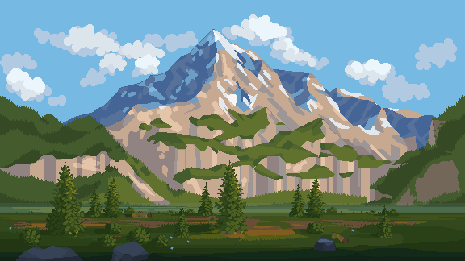
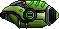
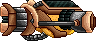
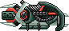
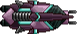
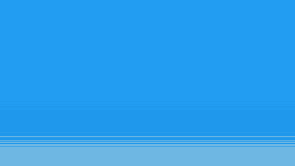
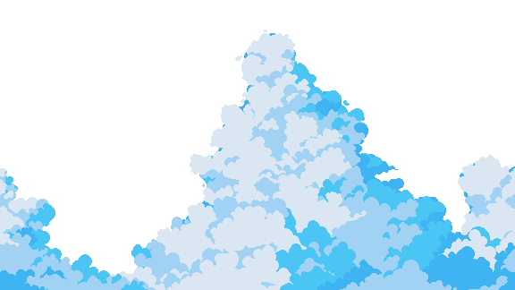
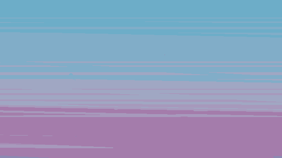
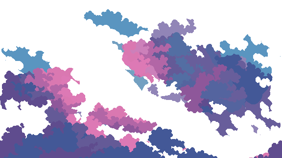
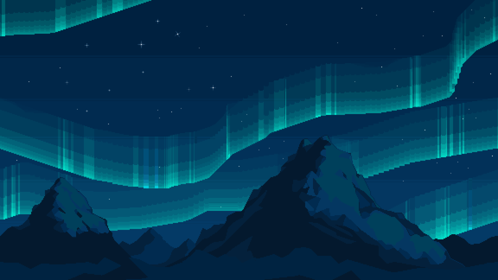

<div align="center">



# 🚀 Sky Shooter

### Um shooter 2D desenvolvido em Python com Pygame


&nbsp;&nbsp;

&nbsp;&nbsp; ⚡ &nbsp;&nbsp;

&nbsp;&nbsp;


<br><br>


</div>

---

## 🎮 Sobre o projeto

**Sky Shooter** é um jogo de tiro 2D desenvolvido em **Python utilizando Pygame**.

O jogador controla uma nave e precisa enfrentar inimigos enquanto atravessa diferentes níveis, desviando de ataques e destruindo naves adversárias para acumular pontos.

O projeto foi desenvolvido como exercício prático de programação, explorando conceitos como **Programação Orientada a Objetos, eventos, colisões, gerenciamento de entidades, persistência de pontuação e desenvolvimento de jogos com Pygame**.

---

## 👾 Modos de jogo

O Sky Shooter possui diferentes formas de jogar:

* 🎮 **1 Player**
* 🤝 **2 Players — Cooperative**
* ⚔️ **2 Players — Competitive**
* 🏆 **Score**
* 🚪 **Exit**

---

## 🕹️ Controles

### 🔵 Player 1

| Ação                | Tecla          |
| ------------------- | -------------- |
| Mover para cima     | `↑`            |
| Mover para baixo    | `↓`            |
| Mover para esquerda | `←`            |
| Mover para direita  | `→`            |
| Atirar              | `CTRL Direito` |

### 🟠 Player 2

| Ação                | Tecla           |
| ------------------- | --------------- |
| Mover para cima     | `W`             |
| Mover para baixo    | `S`             |
| Mover para esquerda | `A`             |
| Mover para direita  | `D`             |
| Atirar              | `CTRL Esquerdo` |

---

## 🚀 Naves

<div align="center">

### Jogadores

<table>
<tr>
<td align="center">
<br>
<strong>Player 1</strong>
</td>

<td align="center">
<br>
<strong>Player 2</strong>
</td>
</tr>
</table>

### Inimigos

<table>
<tr>
<td align="center">
<br>
<strong>Enemy 1</strong>
</td>

<td align="center">
<br>
<strong>Enemy 2</strong>
</td>
</tr>
</table>

</div>

---

## 💥 Projéteis

<div align="center">


&nbsp;&nbsp;&nbsp;&nbsp;

&nbsp;&nbsp;&nbsp;&nbsp;

&nbsp;&nbsp;&nbsp;&nbsp;


</div>

---

## 🌌 Fases

O jogo possui diferentes cenários construídos utilizando múltiplas camadas de background, criando um efeito de movimento e profundidade durante as fases.

### Level 1

<div align="center">




</div>

### Level 2

<div align="center">




</div>

---

## ⚙️ Tecnologias

O projeto utiliza:

* **Python**
* **Pygame**
* **Programação Orientada a Objetos**
* **SQLite**
* Sistema de eventos do Pygame
* Manipulação de sprites e colisões
* Reprodução de áudio
* Persistência de pontuação

---

## 🧠 Conceitos aplicados

Durante o desenvolvimento do projeto foram utilizados conceitos importantes de desenvolvimento de software, como:

* Classes e herança
* Encapsulamento
* Polimorfismo
* Factory
* Mediator
* Gerenciamento de entidades
* Detecção de colisões
* Eventos
* Game Loop
* Controle de FPS
* Movimentação de sprites
* Sistema de vida e dano
* Sistema de pontuação
* Persistência de dados

---

## 📂 Estrutura do projeto

```text
Sky-Shooter/
│
├── asset/
│   ├── Enemy1.png
│   ├── Enemy2.png
│   ├── Player1.png
│   ├── Player2.png
│   ├── Level1Bg*.png
│   ├── Level2Bg*.png
│   ├── MenuBg.png
│   ├── ScoreBg.png
│   └── ...
│
├── code/
│   ├── Background.py
│   ├── Const.py
│   ├── DBProxy.py
│   ├── Enemy.py
│   ├── EnemyShot.py
│   ├── Entity.py
│   ├── EntityFactory.py
│   ├── EntityMediator.py
│   ├── Game.py
│   ├── Level.py
│   ├── Menu.py
│   ├── Player.py
│   ├── PlayerShot.py
│   └── Score.py
│
├── main.py
└── README.md
```

---

## ▶️ Como executar

### 1. Clone o repositório

```bash
git clone https://github.com/GustavoHortega/Sky-Shooter.git
```

### 2. Entre na pasta

```bash
cd Sky-Shooter
```

### 3. Crie um ambiente virtual

```bash
python -m venv .venv
```

### 4. Ative o ambiente virtual

**Windows**

```bash
.venv\Scripts\activate
```

**Linux / macOS**

```bash
source .venv/bin/activate
```

### 5. Instale o Pygame

```bash
pip install pygame
```

### 6. Execute o jogo

```bash
python main.py
```

---

## 🏆 Sistema de pontuação

Ao destruir inimigos, os jogadores acumulam pontos durante as fases.

O jogo também possui uma tela dedicada aos **scores**, permitindo registrar e visualizar as pontuações obtidas.

<div align="center">



</div>

---

## 🎯 Objetivo do projeto

Este projeto foi desenvolvido com foco no aprendizado prático de **Python e desenvolvimento de jogos**, aplicando conceitos estudados durante a graduação em Engenharia de Software.

Além da construção do jogo, o projeto busca exercitar a organização de código, divisão de responsabilidades entre classes e aplicação de padrões de projeto em um cenário real.

---

<div align="center">

## 👨‍💻 Autor

**Gustavo Hortega**

[](https://github.com/GustavoHortega)

<br>


&nbsp;


### 🚀 Ready Player? Let's Fly!

</div>
